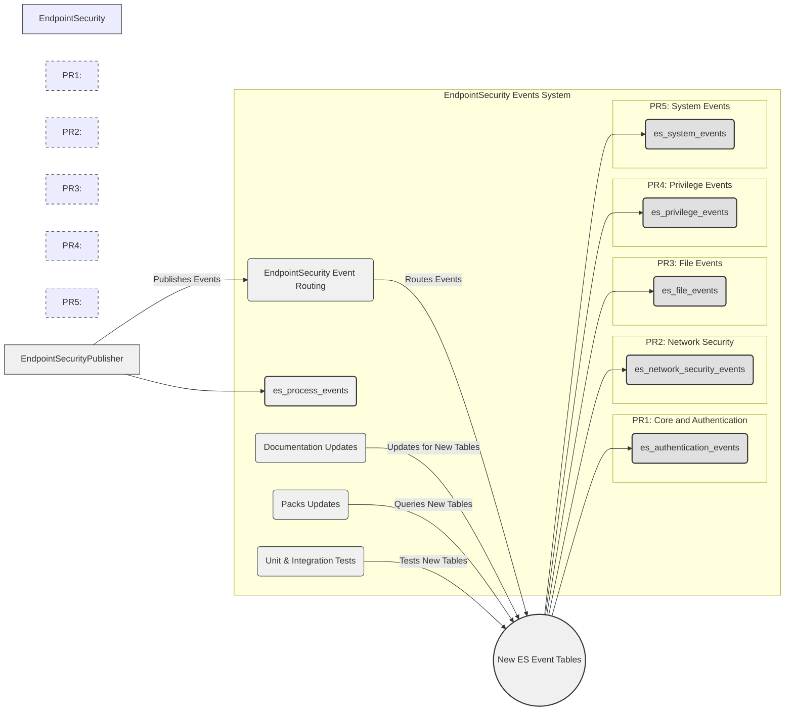
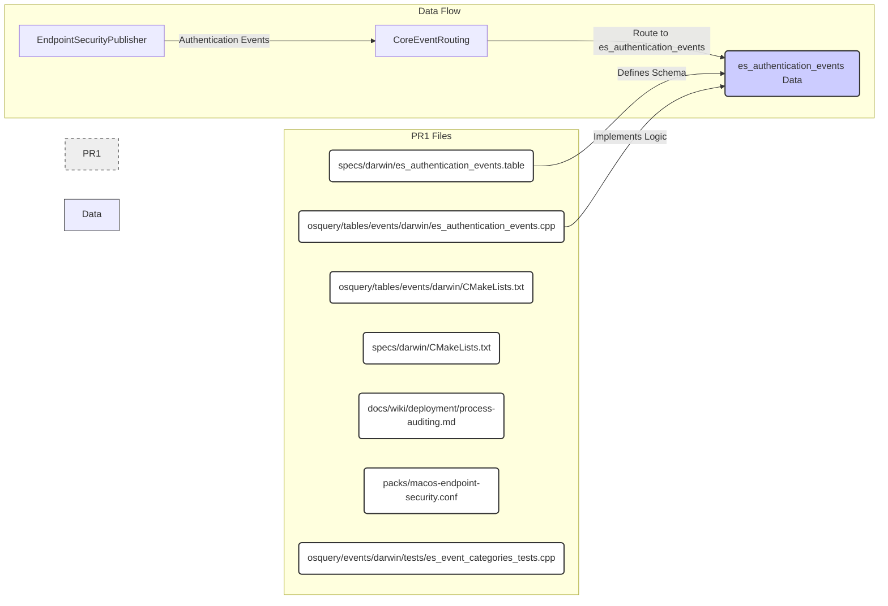
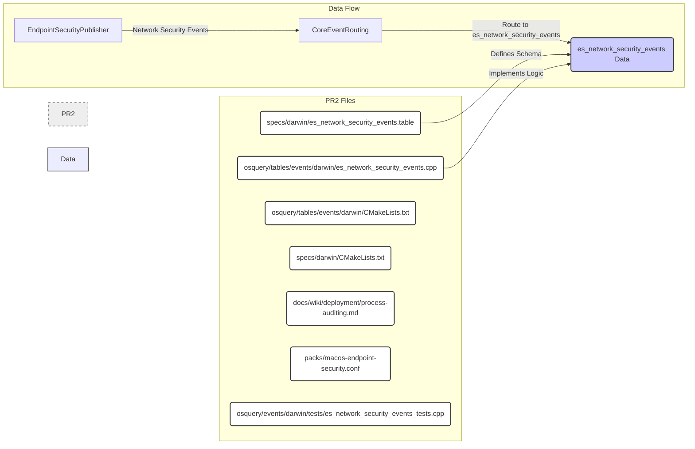
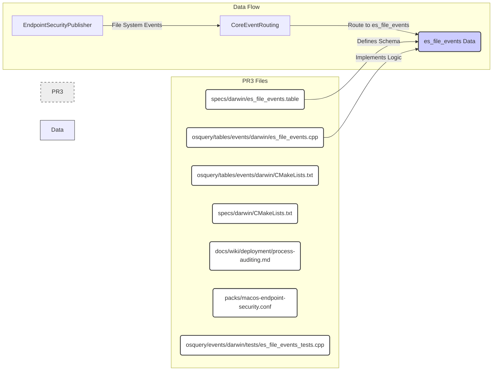
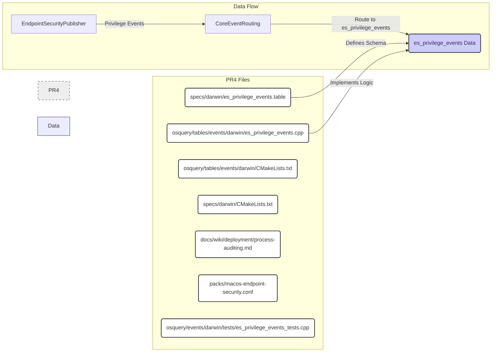
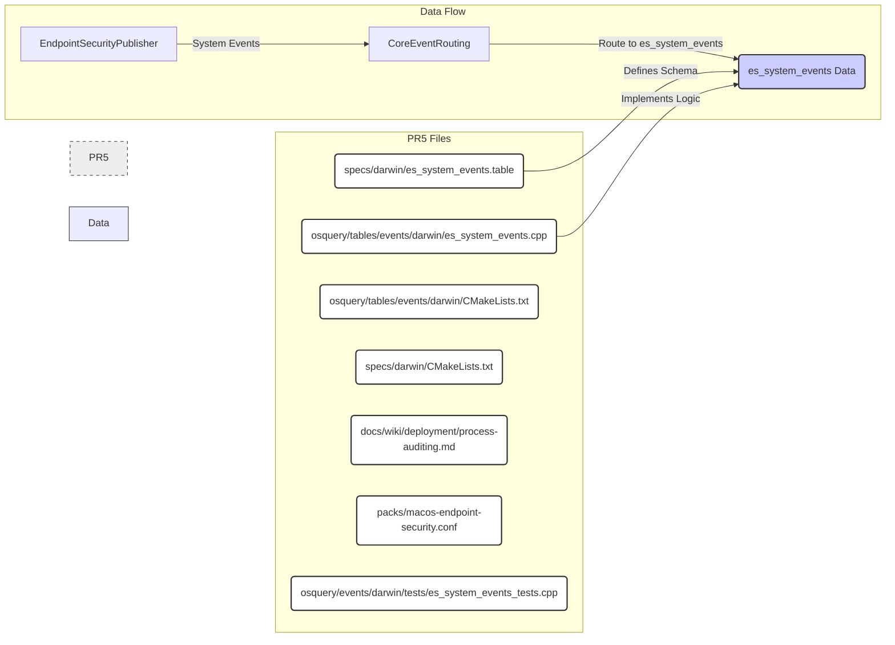

# Comprehensive Plan for Modular EndpointSecurity Event System: Detailed PR Breakdown

This document provides an exhaustive, commit-by-commit plan for building a modular EndpointSecurity event system in osquery from scratch. We are designing a suite of five specialized tables, replacing the need for a single, broad `es_security_events` table. This detailed plan prioritizes clarity, thorough testing, and efficient, incremental code review.

## 1. High-Level Overview: Component Diagram

This component diagram provides a top-level view of the refactoring project, highlighting the major PRs, the new table structure, and key components involved.



## 2. PR1: Core Infrastructure & `es_authentication_events` Table - Full Details

### 2.1. PR1 Diagram: File and Data Flow



### 2.2. PR1 Commit Breakdown, Table Schema, and Description

*   **Commit 1: `macos: es_event: Implement core event routing infrastructure`**
    *   **Description:**  This commit introduces the foundational code changes required to support multiple, specialized event tables. It focuses on event routing and sets the stage for subsequent table implementations.

    *   **Code Changes:**
        *   **`osquery/events/darwin/endpointsecurity.cpp`**:
            *   Modify `EndpointSecurityPublisher::handleMessage` to include a basic event routing mechanism.  This will initially route only authentication events (for testing purposes) and leave other events unrouted or directed to a default handler (which might be the original `es_security_events` logic temporarily).
        *   **`osquery/events/darwin/endpointsecurity.h`**:
            *   Define abstract base classes or interfaces for new event subscribers (e.g., `BaseESEventSubscriber`) and event contexts (e.g., `BaseESEventContext`). These will be extended by specific table implementations.

    *   **Documentation:**
        *   **`docs/wiki/deployment/process-auditing.md`**: Add a section outlining the new modular table architecture and the core event routing concept. Explain the benefits of this approach (maintainability, efficiency, clarity).

    *   **Testing:**
        *   Run existing unit tests for `es_events` and integration tests for `es_process_events` to ensure no regressions are introduced by the core infrastructure changes.  At this stage, no specific tests for `es_authentication_events` exist yet.

*   **Commit 2: `macos: table_es_auth_event: Implement es_authentication_events table`**
    *   **Description:** This commit implements the `es_authentication_events` table, including its schema, data population logic, and initial tests.

    *   **Code Changes:**
        *   **`specs/darwin/es_authentication_events.table`**:
            ```markdown
            table_name("es_authentication_events")
            description("Logs authentication-related events from EndpointSecurity.")
            schema([
                Column("time", BIGINT, "Time of event in UNIX seconds"),
                Column("pid", BIGINT, "Process ID of the authenticating process"),
                Column("username", TEXT, "Username associated with the authentication attempt"),
                Column("event_type", TEXT, "Specific type of authentication event (e.g., 'login', 'sudo', 'ssh_login')"),
                Column("success", BOOLEAN, "Indicates if the authentication attempt was successful"),
                Column("auth_type", TEXT, "Authentication mechanism used (e.g., 'password', 'touchid', 'kerberos')"),
                Column("result_type", TEXT, "Detailed result type of the authentication attempt"),
                Column("remote_address", TEXT, "Remote IP address (if applicable, e.g., for SSH logins)"),
                Column("remote_port", INTEGER, "Remote port (if applicable)"),
                Column("eid", TEXT, "Event ID", hidden=True),
            ])
            attributes(event_subscriber=True)
            implementation("events/darwin/es_authentication_events@ESAuthenticationEventSubscriber::genTable")
            examples([
              "SELECT time, pid, username, event_type, success FROM es_authentication_events ORDER BY time DESC LIMIT 10",
              "SELECT * FROM es_authentication_events WHERE event_type = 'sudo' AND success = 'false'",
              "SELECT username, auth_type, result_type, remote_address FROM es_authentication_events WHERE event_type = 'ssh_login' AND success = 1"
            ])
            ```
        *   **`osquery/tables/events/darwin/es_authentication_events.cpp`**: Implement the `ESAuthenticationEventSubscriber` class.
            *   `init()`: Subscribe to relevant EndpointSecurity event types (e.g., `ES_EVENT_TYPE_NOTIFY_AUTHENTICATION`, `ES_EVENT_TYPE_NOTIFY_SU`, `ES_EVENT_TYPE_NOTIFY_SUDO`).
            *   `Callback()`: Implement the event callback function to:
                *   Filter incoming `es_security_events` for authentication-related events.
                *   Extract relevant data fields (time, PID, username, event type, success, auth type, result type) from the `EndpointSecurityEventContextRef& ec`.
                *   Populate `Row` objects with the extracted data.
            *   `genTable()`: Implement the table generation function to return the collected `Row` data.
        *   **`osquery/tables/events/darwin/CMakeLists.txt`**: Add `es_authentication_events.cpp` to `table_sources`.
        *   **`specs/darwin/CMakeLists.txt`**: Add `es_authentication_events.table` to `spec_table_files`.

    *   **Documentation:**
        *   **`docs/wiki/deployment/process-auditing.md`**: Add detailed documentation for the `es_authentication_events` table, including:
            *   Table description and purpose.
            *   Schema definition (column names and descriptions).
            *   Example queries demonstrating how to use the table to monitor authentication events.

    *   **Testing:**
        *   Create basic integration tests for `es_authentication_events`:
            *   Write a test query (e.g., `SELECT * FROM es_authentication_events LIMIT 1`) and execute `osqueryi` with the new table enabled.
            *   Assert that the query returns data and that the schema of the returned data matches the defined table schema.
            *   Potentially add tests to simulate authentication events (using `sudo`, `su`, etc.) and verify that these events are captured in the `es_authentication_events` table.

*   **Commit 3: `docs(es_auth_events): Enhance packs and documentation for es_authentication_events`**
    *   **Description:** This commit focuses on improving the user experience and data accessibility for the `es_authentication_events` table by updating the osquery packs and refining documentation.

    *   **Code Changes:**
        *   **`packs/macos-endpoint-security.conf`**:
            *   Update the existing `es_authentication_events` query in the pack to now query the newly created `es_authentication_events` table instead of the generic `es_security_events`.
            *   Add new example queries to the pack that showcase the specific capabilities of the `es_authentication_events` table, such as queries to:
                *   Monitor failed sudo attempts.
                *   Track successful SSH logins.
                *   Identify unusual authentication patterns.

    *   **Documentation:**
        *   **`docs/wiki/deployment/process-auditing.md`**:
            *   Refine the documentation for `es_authentication_events` based on the implementation and initial testing.
            *   Add more comprehensive and practical example queries to the documentation, mirroring the examples added to the osquery pack.
            *   Update the main table listing in `docs/wiki/deployment/process-auditing.md` to clearly indicate that `es_authentication_events` is now a separate, dedicated table for authentication events.

## 3. PR2: `es_network_security_events` Table - Detailed Commits

### 3.1. PR2 Diagram: File and Data Flow



### 3.2. PR2 Commit Breakdown, Table Schema, and Description

*   **Commit 1: `macos: table_es_netsec_event: Create es_network_security_events table and subscriber`**
    *   **Description:** This commit implements the `es_network_security_events` table and subscriber for network security events.

    *   **Code Changes:**
        *   **`specs/darwin/es_network_security_events.table`**:
            ```markdown
            table_name("es_network_security_events")
            description("Logs network-related security events from EndpointSecurity.")
            schema([
                Column("time", BIGINT, "Time of event in UNIX seconds"),
                Column("pid", BIGINT, "Process ID of the process initiating network activity"),
                Column("username", TEXT, "Username associated with the process"),
                Column("event_type", TEXT, "Type of network event (e.g., 'connect', 'bind')"),
                Column("socket_domain", TEXT, "Socket domain (e.g., 'AF_INET', 'AF_UNIX')"),
                Column("local_address", TEXT, "Local IP address (if applicable)"),
                Column("local_port", INTEGER, "Local port (if applicable)"),
                Column("remote_address", TEXT, "Remote IP address (if applicable)"),
                Column("remote_port", INTEGER, "Remote port (if applicable)"),
                Column("socket_path", TEXT, "Path to the UNIX domain socket (if applicable)"),
                Column("backlog", INTEGER, "Connection backlog for 'listen' events (if applicable)"),
                Column("eid", TEXT, "Event ID", hidden=True),
            ])
            attributes(event_subscriber=True)
            implementation("events/darwin/es_network_security_events@ESNetworkSecurityEventSubscriber::genTable")
            examples([
              "SELECT * FROM es_network_security_events ORDER BY time DESC LIMIT 10",
              "SELECT * FROM es_network_security_events WHERE event_type = 'connect' AND remote_port = 443",
              "SELECT socket_path, pid, username FROM es_network_security_events WHERE event_type = 'uipc_bind'"
            ])
            ```
        *   **`osquery/tables/events/darwin/es_network_security_events.cpp`**: Implement `ESNetworkSecurityEventSubscriber` to handle network events.
        *   **`osquery/tables/events/darwin/CMakeLists.txt`**: Add `es_network_security_events.cpp`.
        *   **`specs/darwin/CMakeLists.txt`**: Add `es_network_security_events.table`.
        *   **`osquery/events/darwin/endpointsecurity.cpp`**: Update `CoreEventRouter` to route network events to `ESNetworkSecurityEventSubscriber`.

    *   **Documentation:**
        *   **`docs/wiki/deployment/process-auditing.md`**: Add documentation for `es_network_security_events`, including schema and example queries.

    *   **Testing:**
        *   Create integration tests for `es_network_security_events`.

*   **Commit 2: `docs(es_netsec_events): Document and provide examples for es_network_security_events`**
    *   **Description:** Enhances data access and user experience for `es_network_security_events`.

    *   **Code Changes:**
        *   **`packs/macos-endpoint-security.conf`**: Update pack queries to use `es_network_security_events`.

    *   **Documentation:**
        *   **`docs/wiki/deployment/process-auditing.md`**: Refine documentation and examples for `es_network_security_events`.

## 4. PR3: `es_file_events` Table - Detailed Commits

### 4.1. PR3 Diagram: File and Data Flow



### 4.2. PR3 Commit Breakdown, Table Schema, and Description

*   **Commit 1: `macos: table_es_file_event: Create es_file_events table and subscriber`**
    *   **Description:** This commit implements the `es_file_events` table and subscriber, focusing on file system security events.

    *   **Code Changes:**
        *   **`specs/darwin/es_file_events.table`**:
            ```markdown
            table_name("es_file_events")
            description("Logs file system related security events (excluding FIM) from EndpointSecurity.")
            schema([
                Column("time", BIGINT, "Time of event in UNIX seconds"),
                Column("pid", BIGINT, "Process ID of the process performing file system operation"),
                Column("username", TEXT, "Username associated with the process"),
                Column("event_type", TEXT, "Type of file system event (e.g., 'mount', 'chmod')"),
                Column("path", TEXT, "File path involved in the event"),
                Column("file_mode", TEXT, "File mode (for chmod events)"),
                Column("eid", TEXT, "Event ID", hidden=True),
            ])
            attributes(event_subscriber=True)
            implementation("events/darwin/es_file_events@ESFileEventSubscriber::genTable")
            examples([
              "SELECT * FROM es_file_events ORDER BY time DESC LIMIT 10",
              "SELECT * FROM es_file_events WHERE event_type = 'mount'",
              "SELECT path, file_mode FROM es_file_events WHERE event_type = 'chmod' AND file_mode LIKE '777%'"
            ])
            ```
        *   **`osquery/tables/events/darwin/es_file_events.cpp`**: Implement `ESFileEventSubscriber` to handle file system events.
        *   **`osquery/tables/events/darwin/CMakeLists.txt`**: Add `es_file_events.cpp`.
        *   **`specs/darwin/CMakeLists.txt`**: Add `es_file_events.table`.
        *   **`osquery/events/darwin/endpointsecurity.cpp`**: Update `CoreEventRouter` to route file system events to `ESFileEventSubscriber`.

    *   **Documentation:**
        *   **`docs/wiki/deployment/process-auditing.md`**: Add documentation for `es_file_events`.

    *   **Testing:**
        *   Create integration tests for `es_file_events`.

*   **Commit 2: `docs(es_file_events): Document and provide examples for es_file_events`**
    *   **Description:** Enhances data access and user experience for `es_file_events`.

    *   **Code Changes:**
        *   **`packs/macos-endpoint-security.conf`**: Update pack queries to use `es_file_events`.

    *   **Documentation:**
        *   **`docs/wiki/deployment/process-auditing.md`**: Refine documentation and examples for `es_file_events`.

## 5. PR4: `es_privilege_events` Table - Detailed Commits

### 5.1. PR4 Diagram: File and Data Flow



### 5.2. PR4 Commit Breakdown, Table Schema, and Description

*   **Commit 1: `macos: table_es_priv_event: Create es_privilege_events table and subscriber`**
    *   **Description:** Implements the `es_privilege_events` table and subscriber, focusing on privilege escalation events.

    *   **Code Changes:**
        *   **`specs/darwin/es_privilege_events.table`**:
            ```markdown
            table_name("es_privilege_events")
            description("Logs privilege escalation and user/group ID change events from EndpointSecurity.")
            schema([
                Column("time", BIGINT, "Time of event in UNIX seconds"),
                Column("pid", BIGINT, "Process ID attempting privilege change"),
                Column("username", TEXT, "Username of the process"),
                Column("event_type", TEXT, "Type of privilege event (e.g., 'setuid', 'setgid')"),
                Column("target_uid", BIGINT, "Target User ID (for setuid events)"),
                Column("target_gid", BIGINT, "Target Group ID (for setgid events)"),
                Column("eid", TEXT, "Event ID", hidden=True),
            ])
            attributes(event_subscriber=True)
            implementation("events/darwin/es_privilege_events@ESPrivilegeEventSubscriber::genTable")
            examples([
              "SELECT * FROM es_privilege_events ORDER BY time DESC LIMIT 10",
              "SELECT * FROM es_privilege_events WHERE event_type = 'setuid' AND target_uid = 0",
              "SELECT username, event_type, target_uid FROM es_privilege_events WHERE event_type LIKE 'setuid%'"
            ])
            ```
        *   **`osquery/tables/events/darwin/es_privilege_events.cpp`**: Implement `ESPrivilegeEventSubscriber` to handle privilege events.
        *   **`osquery/tables/events/darwin/CMakeLists.txt`**: Add `es_privilege_events.cpp`.
        *   **`specs/darwin/CMakeLists.txt`**: Add `es_privilege_events.table`.
        *   **`osquery/events/darwin/endpointsecurity.cpp`**: Update `CoreEventRouter` to route privilege events to `ESPrivilegeEventSubscriber`.

    *   **Documentation:**
        *   **`docs/wiki/deployment/process-auditing.md`**: Add documentation for `es_privilege_events`.

    *   **Testing:**
        *   Create integration tests for `es_privilege_events`.

*   **Commit 2: `docs(es_priv_events): Document and provide examples for es_privilege_events`**
    *   **Description:** Enhances data access and user experience for `es_privilege_events`.

    *   **Code Changes:**
        *   **`packs/macos-endpoint-security.conf`**: Update pack queries to use `es_privilege_events`.

    *   **Documentation:**
        *   **`docs/wiki/deployment/process-auditing.md`**: Refine documentation and examples for `es_privilege_events`.

## 6. PR5: `es_system_events` Table - Detailed Commits

### 6.1. PR5 Diagram: File and Data Flow



### 6.2. PR5 Commit Breakdown, Table Schema, and Description

*   **Commit 1: `macos: table_es_sys_event: Create es_system_events table and subscriber`**
*   **Description:** Implements the `es_system_events` table for remaining system-level security events that don't fit into other categories.

    *   **Code Changes:**
        *   **`specs/darwin/es_system_events.table`**:
            ```markdown
            table_name("es_system_events")
            description("Logs system-level security events from EndpointSecurity (kext, screensharing, etc.).")
            schema([
                Column("time", BIGINT, "Time of event in UNIX seconds"),
                Column("pid", BIGINT, "Process ID initiating the system event"),
                Column("username", TEXT, "Username associated with the event"),
                Column("event_type", TEXT, "Type of system event (e.g., 'kextload', 'screensharing_attach')"),
                Column("kext_id", TEXT, "Kernel extension ID (for kext events)"),
                Column("screensharing_type", TEXT, "Screensharing event type (for screensharing events)"),
                Column("eid", TEXT, "Event ID", hidden=True),
            ])
            attributes(event_subscriber=True)
            implementation("events/darwin/es_system_events@ESSystemEventSubscriber::genTable")
            examples([
              "SELECT * FROM es_system_events ORDER BY time DESC LIMIT 10",
              "SELECT * FROM es_system_events WHERE event_type = 'kextload'",
              "SELECT * FROM es_system_events WHERE event_type = 'screensharing_attach'"
            ])
            ```
        *   **`osquery/tables/events/darwin/es_system_events.cpp`**: Implement `ESSystemEventSubscriber` to handle system events.
        *   **`osquery/tables/events/darwin/CMakeLists.txt`**: Add `es_system_events.cpp`.
        *   **`specs/darwin/CMakeLists.txt`**: Add `es_system_events.table`.
        *   **`osquery/events/darwin/endpointsecurity.cpp`**: Update `CoreEventRouter` to route system events to `ESSystemEventSubscriber`.

    *   **Documentation:**
        *   **`docs/wiki/deployment/process-auditing.md`**: Add documentation for `es_system_events`.

    *   **Testing:**
        *   Create integration tests for `es_system_events`.

*   **Commit 2: `docs(es_sys_events): Document and provide examples for es_system_events`**
    *   **Description:** Enhances data access and user experience for the `es_system_events` table.

    *   **Code Changes:**
        *   **`packs/macos-endpoint-security.conf`**: Update pack queries to use `es_system_events`.

    *   **Documentation:**
        *   **`docs/wiki/deployment/process-auditing.md`**: Refine documentation and examples for `es_system_events`.

This comprehensive document, with multi-level diagrams and detailed commit breakdowns for all five PRs, provides a complete and actionable roadmap for building the modular EndpointSecurity event system. The granular approach, combined with the emphasis on documentation and testing at each stage, ensures a high-quality, maintainable, and user-friendly final product.
