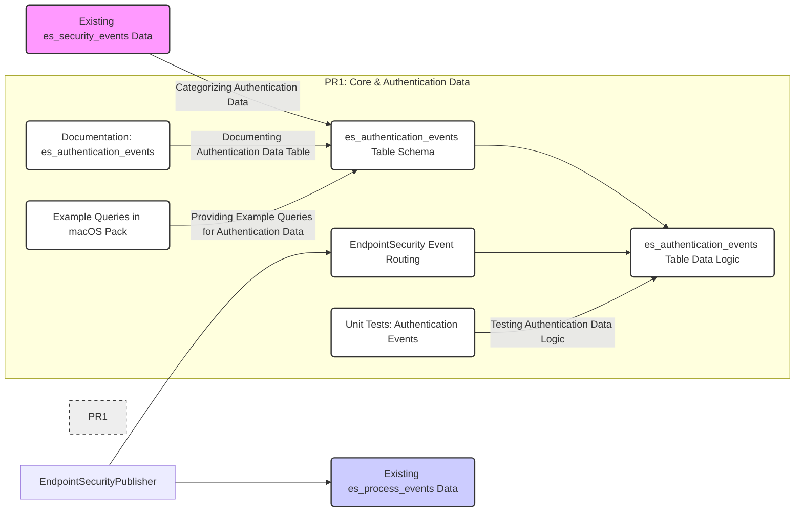
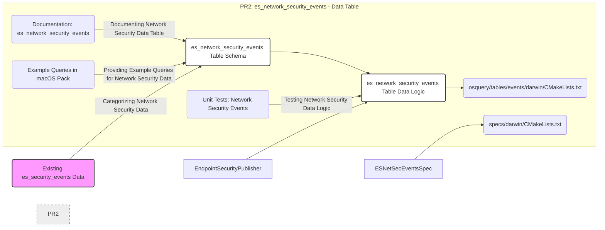

# Modularizing EndpointSecurity Events: A Data-Centric Approach

This document outlines a data-driven strategy for enhancing osquery's EndpointSecurity event handling.  Instead of a single, monolithic `es_security_events` table, we are proposing a modular design with a suite of specialized tables. Each table will be dedicated to a distinct category of security events, providing a more organized, efficient, and user-friendly data access experience.

## Conceptual Data Flow and PR Structure

Our approach is to categorize EndpointSecurity events based on their inherent nature and create dedicated tables for each category. This data-centric approach will be implemented across a series of Pull Requests (PRs), each focused on a specific event category and its corresponding table.

The PRs will be sequenced to ensure a logical and manageable development process:

1.  **PR1: Core Event Routing & Authentication Data Table**: Establishes the fundamental event routing mechanism and creates the first specialized table, `es_authentication_events`, to house authentication-related data.
2.  **PR2: Network Security Data Table**: Introduces the `es_network_security_events` table, designed to capture and organize network-related security event data.
3.  **PR3: File System Security Data Table**: Creates the `es_file_events` table, dedicated to file system security event data, distinct from file integrity monitoring.
4.  **PR4: Privilege Management Data Table**: Implements the `es_privilege_events` table, focusing on data related to privilege escalation and user/group ID changes.
5.  **PR5: System-Level Security Data Table**: Adds the `es_system_events` table, encompassing a broader range of system-level security data that doesn't fit into the other specialized categories.

## 1. PR1: Core Event Routing & Authentication Data Table

This initial PR is crucial as it establishes the core data routing logic and delivers the first specialized data table, `es_authentication_events`.

**Conceptual Focus of Commits in PR1:**

*   **Commit 1: `feat(es_events): Core event routing infrastructure`**
    *   **Conceptual Change:** Implement a central routing mechanism within the `EndpointSecurityPublisher` to direct incoming events to the appropriate specialized data tables based on their event type. This establishes the foundation for modularity.
    *   **Data Flow Impact:**  Events begin to be conceptually categorized and prepared for routing, even if initially only authentication events are actively routed.
    *   **Documentation:**  Document the new event routing concept in the architecture overview within `docs/wiki/deployment/process-auditing.md`.
    *   **Testing:** Focus on ensuring the core routing mechanism is functional and doesn't disrupt existing `es_process_events` data flow.

*   **Commit 2: `feat(table_es_auth_events): Authentication data table implementation`**
    *   **Conceptual Change:** Create a dedicated data table, `es_authentication_events`, specifically designed to store and organize authentication-related event data. This provides a focused view of authentication activities.
    *   **Data Organization:** Define a schema for `es_authentication_events` that includes columns relevant to authentication events (e.g., `username`, `auth_type`, `success`, `result_type`). Implement the data logic to populate this table by filtering and transforming data from the raw EndpointSecurity events.
    *   **Documentation:** Document the schema and purpose of the `es_authentication_events` table in `docs/wiki/deployment/process-auditing.md`, emphasizing its data focus and benefits for authentication monitoring.
    *   **Testing:** Implement unit tests to verify the data population logic for `es_authentication_events`, ensuring data integrity and schema adherence.

*   **Commit 3: `docs(es_auth_events): Enhance data access and user experience for authentication events`**
    *   **Conceptual Change:** Improve data accessibility and user experience by providing example queries and integrating the new table into relevant osquery packs.
    *   **Data Access:** Update the `macos-endpoint-security.conf` pack to include example queries that demonstrate how to effectively query and analyze authentication data from the `es_authentication_events` table.
    *   **Documentation:** Refine the documentation for `es_authentication_events` to include practical query examples and highlight how this specialized table simplifies authentication data analysis for users.

## 2. PR2: `es_network_security_events` Table (and subsequent PRs follow a similar pattern)

PR2 focuses on creating the `es_network_security_events` table, dedicated to organizing network security event data.

**Conceptual Focus of Commits in PR2 (and similar for PR3-PR5):**

*   **Commit 1: `feat(table_es_netsec_events): Network security data table implementation`**
    *   **Conceptual Change:** Create a dedicated data table, `es_network_security_events`, to organize network security event data, providing a focused view of network activities.
    *   **Data Organization:** Define a schema for `es_network_security_events` with columns relevant to network events (e.g., `socket_domain`, `remote_address`, `local_port`, `protocol`). Implement data logic to populate this table by filtering and transforming data.
    *   **Documentation:** Document the schema and purpose of `es_network_security_events` in `docs/wiki/deployment/process-auditing.md`, highlighting its data focus and benefits for network monitoring.
    *   **Testing:** Implement unit tests to verify the data population logic for `es_network_security_events`.

*   **Commit 2: `docs(es_netsec_events): Enhance data access and user experience for network security events`**
    *   **Conceptual Change:** Improve data accessibility and user experience for network security data.
    *   **Data Access:** Update the `macos-endpoint-security.conf` pack with example queries for `es_network_security_events`, showcasing network-focused data analysis.
    *   **Documentation:** Refine documentation for `es_network_security_events` with practical query examples and emphasize its value for network security investigations.

**(PR3, PR4, PR5 would follow the same commit structure, replacing "network security" with "file system security", "privilege management", and "system-level security" respectively.)**

## Data-Driven Benefits of Modular Tables

*   **Improved Data Organization:**  Data is logically grouped into specialized tables, making it easier to understand and navigate.
*   **Enhanced Query Efficiency:** Queries become more efficient as they target only the relevant data table instead of scanning a large, general-purpose table.
*   **Simplified Data Analysis:**  Users can focus on specific security domains (authentication, network, file system, etc.) by querying the dedicated tables, streamlining analysis workflows.
*   **Clearer Data Semantics:** Each table has a well-defined purpose and schema, improving data clarity and reducing ambiguity.

This data-centric, modular approach will result in a more robust, efficient, and user-friendly EndpointSecurity event system within osquery, aligning with best practices for data organization and maintainability.